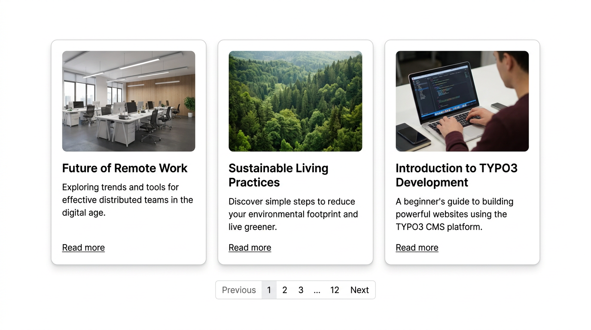
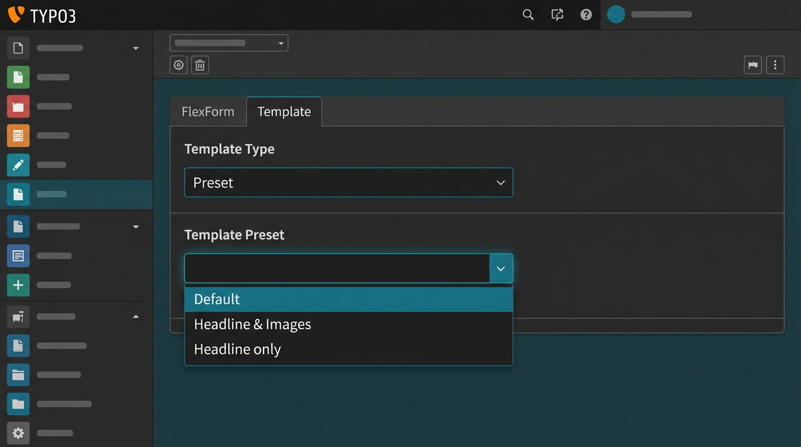
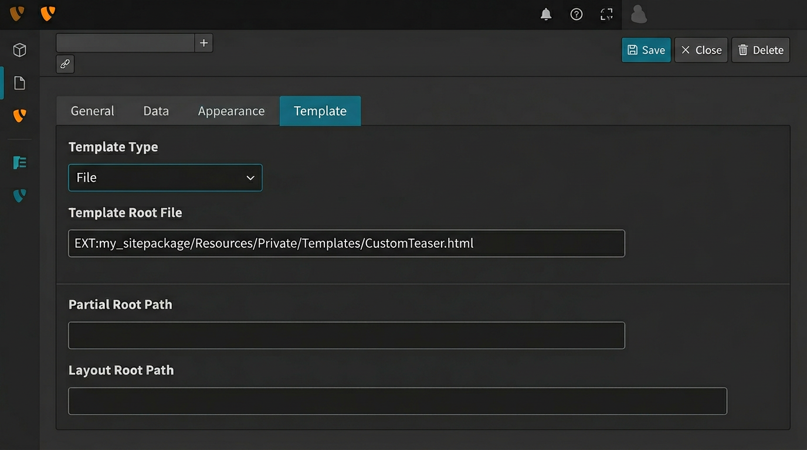
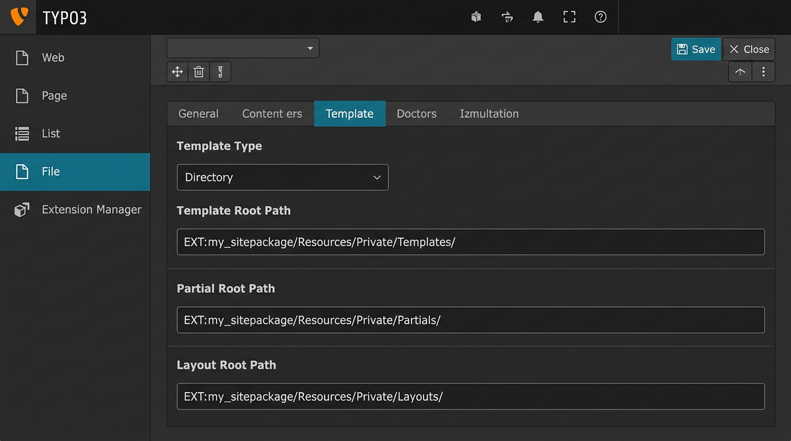

.. include:: ../Includes.txt

.. _templates:

Templates
=========

.. contents:: :local:

.. _template-types:

Template types
--------------

pw_teaser uses Fluid templates and offers **three template modes** to choose
from. Each mode gives you a different level of control over how teasers are
rendered. You select the mode in the plugin's FlexForm settings under the
**Template** tab.

   Example frontend output: teaser cards with images, titles, descriptions, and numbered pagination.

.. _template-type-preset:

Mode 1: Preset
~~~~~~~~~~~~~~~

The **Preset** mode is the recommended default for most projects. It lets
integrators define named template configurations in TypoScript, and editors
pick from those presets in a dropdown — no path knowledge required.

   The Preset mode in the TYPO3 backend: editors choose from a dropdown of configured presets.

pw_teaser ships with three presets out of the box:

.. list-table::
   :header-rows: 1
   :widths: 20 40 40

   * - Preset key
     - Label
     - Description
   * - ``default``
     - Default
     - Full teaser with title, subtitle, abstract, media, and categories
   * - ``headlineAndImage``
     - Headline & Images
     - Compact cards with headline and page media
   * - ``headlineOnly``
     - Headline only
     - Minimal list showing only page titles

**How it works internally**: When an editor selects a preset, the controller
resolves the preset's ``templateRootFile``, ``partialRootPaths``, and
``layoutRootPaths`` from TypoScript, then switches to file-based rendering
transparently. This means presets are really just a user-friendly wrapper
around file mode.

Registering custom presets in TypoScript
^^^^^^^^^^^^^^^^^^^^^^^^^^^^^^^^^^^^^^^^

Add your own presets in your site package's TypoScript setup:

.. code-block:: typoscript

   plugin.tx_pwteaser {
       view {
           presets {
               myCustomPreset {
                   label = My Custom Teaser Layout
                   templateRootFile = EXT:my_sitepackage/Resources/Private/Templates/PwTeaser/Custom.html
                   partialRootPaths.10 = EXT:my_sitepackage/Resources/Private/Partials/PwTeaser
                   layoutRootPaths.10 = EXT:my_sitepackage/Resources/Private/Layouts/PwTeaser
               }
           }
       }
   }

After saving and clearing the TYPO3 system cache, the new preset appears
in the plugin's dropdown.

.. tip::
   The ``label`` supports ``LLL:`` references for multi-language labels:

   .. code-block:: typoscript

      label = LLL:EXT:my_sitepackage/Resources/Private/Language/locallang.xlf:pwteaser.preset.custom

.. note::
   Changes in TypoScript presets require clearing TYPO3's system caches
   before they appear in the backend dropdown.

.. _template-type-file:

Mode 2: File
~~~~~~~~~~~~~

**File** mode gives full design freedom by pointing to a single Fluid
template file. Use this when you need a one-off design that doesn't fit
into the preset system.

   The File mode: specify a template file path, plus optional partial and layout root paths.

When ``view.templateType`` is set to ``file``, provide:

- **Template Root File** (required): Full path to the Fluid template,
  e.g. ``EXT:my_sitepackage/Resources/Private/Templates/PwTeaser/CustomTeaser.html``
- **Partial Root Path** (optional): Additional partials directory
- **Layout Root Path** (optional): Additional layouts directory

.. code-block:: typoscript

   plugin.tx_pwteaser {
       view {
           templateType = file
           templateRootFile = EXT:my_sitepackage/Resources/Private/Templates/PwTeaser/CustomTeaser.html
           partialRootPath = EXT:my_sitepackage/Resources/Private/Partials/PwTeaser
           layoutRootPath = EXT:my_sitepackage/Resources/Private/Layouts/PwTeaser
       }
   }

**When to use File mode**: You have a single, self-contained Fluid template
and don't need the controller/action directory convention. Ideal for
project-specific layouts that only need one template file.

.. _template-type-directory:

Mode 3: Directory
~~~~~~~~~~~~~~~~~

**Directory** mode follows the standard Extbase controller/action convention.
You point pw_teaser to a directory, and it resolves templates using Fluid's
built-in path resolution (``Teaser/Index.html``).

   The Directory mode: specify template, partial, and layout root directories.

When ``view.templateType`` is set to ``directory``, provide:

- **Template Root Path** (required): Directory containing the ``Teaser/``
  folder with ``Index.html``
- **Partial Root Path** (optional): Directory for Fluid partials
- **Layout Root Path** (optional): Directory for Fluid layouts

Your directory structure must follow the Extbase convention:

.. code-block:: text

   EXT:my_sitepackage/Resources/Private/Templates/PwTeaser/
   ├── Teaser/
   │   └── Index.html          ← Main template (resolved automatically)
   ├── Partials/
   │   └── PageCard.html       ← Reusable partial
   └── Layouts/
       └── Default.html        ← Optional layout wrapper

.. code-block:: typoscript

   plugin.tx_pwteaser {
       view {
           templateType = directory
           templateRootPath = EXT:my_sitepackage/Resources/Private/Templates/PwTeaser/
           partialRootPath = EXT:my_sitepackage/Resources/Private/Partials/PwTeaser/
           layoutRootPath = EXT:my_sitepackage/Resources/Private/Layouts/PwTeaser/
       }
   }

**When to use Directory mode**: You want full control over the template
structure with partials, layouts, and the ability to override templates
following the standard Extbase override hierarchy. Best for complex projects
where teasers use shared partials or layout wrappers.

.. _template-mode-comparison:

Comparison
~~~~~~~~~~

.. list-table::
   :header-rows: 1
   :widths: 15 28 28 29

   * - Aspect
     - Preset
     - File
     - Directory
   * - Best for
     - Multi-editor sites
     - Single custom design
     - Complex template structures
   * - Editor control
     - Dropdown selection
     - Path input in FlexForm
     - Path input in FlexForm
   * - Defined in
     - TypoScript + FlexForm
     - FlexForm or TypoScript
     - FlexForm or TypoScript
   * - Partials/Layouts
     - Via preset config
     - Via FlexForm fields
     - Via directory convention
   * - Override hierarchy
     - N/A (single file)
     - N/A (single file)
     - Standard Fluid resolution

.. _writing-templates:

Writing templates
-----------------

The Fluid template receives ``{pages}`` as the main variable — an array of
``Page`` domain model objects. If pagination is enabled, ``{pagination}``
is also available.

Minimal example
~~~~~~~~~~~~~~~

The simplest way to output the prepared (flat) list of pages:

.. code-block:: html

   <ul>
       <f:for each="{pages}" as="page">
           <li>
               <f:link.page pageUid="{page.uid}" title="{page.title}">
                   {page.title}
               </f:link.page>
           </li>
       </f:for>
   </ul>

Card layout example
~~~~~~~~~~~~~~~~~~~

A more complete teaser card with image, title, and description:

.. code-block:: html

   <html xmlns:f="http://typo3.org/ns/TYPO3/CMS/Fluid/ViewHelpers"
         xmlns:pw="http://typo3.org/ns/PwTeaserTeam/PwTeaser/ViewHelpers"
         data-namespace-typo3-fluid="true">

   

       <f:for each="{pages}" as="page">
           

               <f:if condition="{page.media}">
                   <f:for each="{page.media}" as="mediaItem" iteration="i">
                       <f:if condition="{i.isFirst}">
                           <f:image image="{mediaItem}" width="400c" height="225c"
                                    alt="{page.title}" class="teaser-card__image" />
                       </f:if>
                   </f:for>
               </f:if>
               <h3 class="teaser-card__title">{page.title}</h3>
               <f:if condition="{page.abstract}">
                   
{page.abstract}

               </f:if>
               <f:link.page pageUid="{page.uid}" class="teaser-card__link">
                   Read more
               </f:link.page>
           

       </f:for>
   

   </html>

.. _page-model-properties:

Page model properties
~~~~~~~~~~~~~~~~~~~~~

The ``Page`` model exposes all standard ``pages`` table fields:

.. list-table::
   :header-rows: 1
   :widths: 30 15 55

   * - Property
     - Type
     - Description
   * - ``title``
     - string
     - Page title
   * - ``subtitle``
     - string
     - Page subtitle
   * - ``abstract``
     - string
     - Page abstract / teaser text
   * - ``navTitle``
     - string
     - Navigation title
   * - ``description``
     - string
     - Page meta description
   * - ``author``
     - string
     - Author name
   * - ``authorEmail``
     - string
     - Author email
   * - ``keywords``
     - array
     - Keywords as array of strings
   * - ``keywordsAsString``
     - string
     - Keywords as comma-separated string
   * - ``media``
     - FileReference[]
     - Page media (images/files)
   * - ``newUntil``
     - DateTime
     - "New until" date
   * - ``isNew``
     - bool
     - Whether the page is still marked as "new"
   * - ``creationDate``
     - DateTime
     - Creation timestamp
   * - ``tstamp``
     - DateTime
     - Last modification timestamp
   * - ``lastUpdated``
     - DateTime
     - "Last updated" field
   * - ``starttime``
     - DateTime
     - Publish start date
   * - ``endtime``
     - DateTime
     - Publish end date
   * - ``doktype``
     - int
     - Page document type
   * - ``sorting``
     - int
     - Sorting value
   * - ``categories``
     - Category[]
     - Assigned system categories
   * - ``isCurrentPage``
     - bool
     - Whether this is the currently viewed page
   * - ``rootLine``
     - array
     - Root line (parent pages) as array
   * - ``rootLineDepth``
     - int
     - Depth in the page tree (root page = 1)
   * - ``contents``
     - array
     - Content elements (when ``loadContents`` enabled)
   * - ``childPages``
     - Page[]
     - Nested child pages (when ``pageMode = nested``)

**Accessing arbitrary page fields**: Use the ``get`` accessor for any column
in the ``pages`` table, including custom fields from other extensions:

.. code-block:: html

   {page.get.tx_myext_custom_field}

.. note::
   In Fluid 5.0 (TYPO3 14), the ``__call()`` magic method is no longer
   supported. Always use ``{page.get.fieldname}`` for non-modeled fields.

getContent ViewHelper
~~~~~~~~~~~~~~~~~~~~~

The ``pw:getContent`` ViewHelper lets you filter and access specific content
elements from a page's ``contents`` array.

.. code-block:: html

   {namespace pw=PwTeaserTeam\PwTeaser\ViewHelpers}
   <f:for each="{pages}" as="page">
       

           <h3>{page.title}</h3>
           <pw:getContent contents="{page.contents}" as="content"
                          colPos="0" cType="textpic" index="0">
               <f:for each="{content.image}" as="image" iteration="iterator">
                   <f:if condition="{iterator.isFirst} == 1">
                       <f:image src="{image.uid}" treatIdAsReference="1"
                                width="400c" height="100c" />
                   </f:if>
               </f:for>
           </pw:getContent>
       

   </f:for>

**Arguments:**

.. list-table::
   :header-rows: 1
   :widths: 20 15 65

   * - Argument
     - Type
     - Description
   * - ``contents``
     - array
     - The page's content elements (``{page.contents}``)
   * - ``as``
     - string
     - Variable name for the content element inside the ViewHelper
   * - ``colPos``
     - int
     - Filter by column position (0 = default column)
   * - ``cType``
     - string
     - Filter by content type (``image``, ``text``, ``textpic``, etc.)
   * - ``index``
     - int
     - Return only the n-th element (0 = first). Leave empty for all matches.

.. important::
   The ``loadContents`` option must be enabled in the plugin settings for
   ``{page.contents}`` to be populated. This adds an extra database query
   per page, so only enable it when you actually use content element data.

Pagination in templates
~~~~~~~~~~~~~~~~~~~~~~~

When ``enablePagination`` is active, the template receives a ``{pagination}``
variable with three sub-properties:

- ``{pagination.paginator}`` — the paginator object (page items, counts)
- ``{pagination.pagination}`` — navigation links (previous, next, page numbers)
- ``{pagination.currentPage}`` — the currently active page number

.. code-block:: html

   <f:for each="{pagination.paginator.paginatedItems}" as="page">
       <!-- render each teaser card -->
   </f:for>

   <nav class="pagination">
       <f:if condition="{pagination.pagination.previousPageNumber}">
           <f:link.action arguments="{currentPage: pagination.pagination.previousPageNumber}">
               Previous
           </f:link.action>
       </f:if>
       <f:if condition="{pagination.pagination.nextPageNumber}">
           <f:link.action arguments="{currentPage: pagination.pagination.nextPageNumber}">
               Next
           </f:link.action>
       </f:if>
   </nav>
