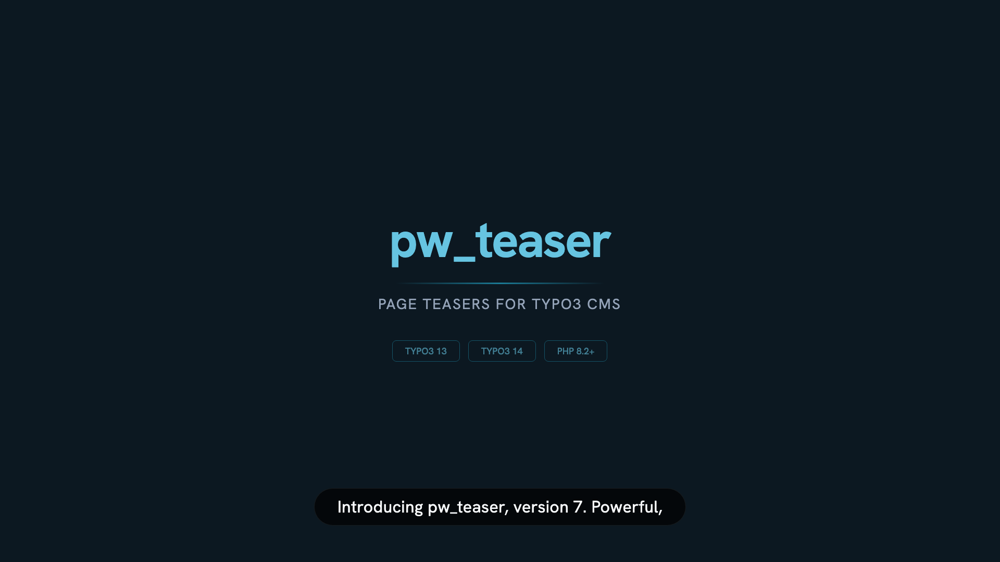

# pw_teaser for TYPO3 CMS

Create powerful, dynamic page teasers in TYPO3 CMS with data from page
properties and its content elements.
Built on Extbase and the Fluid template engine.

<div align="center">

[](#product-tour)

**[Watch the product tour video](#product-tour)** — 3 minutes covering every feature.

</div>

## Product Tour

> The full narrated product tour walks through all features, template modes,
> pagination, and PSR-14 extensibility in under 4 minutes.

https://github.com/dirnbauer/pw_teaser/releases/download/v7.0.0/pw-teaser-product-tour.mp4

*Video generated with [Remotion](https://remotion.dev). Source in [`remotion/`](remotion/).
Regenerate with `npm run remotion:studio`.*

## Compatibility

| pw_teaser | TYPO3    | PHP        |
|-----------|----------|------------|
| 7.x       | 13 – 14  | 8.2 – 8.4 |
| 6.x       | 11 – 13  | 8.1 – 8.3 |
| 5.x       | 10 – 11  | 7.4 – 8.1 |

## Features

- Six page sources — direct children, recursive trees, or hand-picked custom pages
- Filter by categories with AND, OR, and NOT logic
- Sort by title, date, manual order, or random
- **Three template modes** — Preset, File, and Directory — for maximum flexibility
- Built-in pagination with `SimplePagination` (default) and optional
  `georgringer/numbered-pagination`
- Extendable via PSR-14 `ModifyPagesEvent`
- Fully compatible with TYPO3 13 LTS and TYPO3 14


## Installation

```bash
composer require t3/pw_teaser
```

After installation, include the static TypoScript record **PwTeaser** in your
site template so the default view configuration and template presets are loaded.

## Template Modes

pw_teaser offers three ways to control how teasers are rendered. You select the
mode in the plugin's FlexForm under the **Template** tab.

### Mode 1: Preset (recommended)

Editors choose from a dropdown of TypoScript-defined template configurations.
No path knowledge required — integrators define presets, editors pick them.

Three presets ship out of the box:

| Preset key         | Label              | Description                                    |
|--------------------|--------------------|------------------------------------------------|
| `default`          | Default            | Full teaser with title, abstract, media        |
| `headlineAndImage` | Headline & Images  | Compact cards with headline and page media     |
| `headlineOnly`     | Headline only      | Minimal list showing only page titles          |

**Register custom presets** in your site package's TypoScript:

```typoscript
plugin.tx_pwteaser {
    view {
        presets {
            myCustomPreset {
                label = My Custom Teaser Layout
                templateRootFile = EXT:my_sitepackage/Resources/Private/Templates/PwTeaser/Custom.html
                partialRootPaths.10 = EXT:my_sitepackage/Resources/Private/Partials/PwTeaser
                layoutRootPaths.10 = EXT:my_sitepackage/Resources/Private/Layouts/PwTeaser
            }
        }
    }
}
```

### Mode 2: File

Point to a single Fluid template file for full design freedom. Ideal for
one-off designs that don't fit into the preset system.

Set `view.templateType = file` and provide the file path:

```typoscript
plugin.tx_pwteaser {
    view {
        templateType = file
        templateRootFile = EXT:my_sitepackage/Resources/Private/Templates/PwTeaser/CustomTeaser.html
        partialRootPath = EXT:my_sitepackage/Resources/Private/Partials/PwTeaser
    }
}
```

### Mode 3: Directory

Follow the standard Extbase controller/action convention. You provide a
directory root and Fluid resolves `Teaser/Index.html` automatically,
with full support for partials and layouts.

```
EXT:my_sitepackage/Resources/Private/Templates/PwTeaser/
├── Teaser/
│   └── Index.html          ← Resolved automatically
├── Partials/
│   └── PageCard.html
└── Layouts/
    └── Default.html
```

Best for complex projects with shared partials and layout wrappers.

## Pagination

pw_teaser ships with TYPO3 core's `SimplePagination` enabled by default (previous/next navigation).

For numbered pagination with page numbers and ellipsis, install the optional package:

```bash
composer require georgringer/numbered-pagination
```

Then configure via TypoScript:

```typoscript
plugin.tx_pwteaser.settings.paginationClass = GeorgRinger\NumberedPagination\NumberedPagination
```

### Routing configuration

Add the following route enhancer to your site configuration for clean pagination URLs:

```yaml
routeEnhancers:
  PwTeaser:
    type: Extbase
    extension: PwTeaser
    plugin: Pi1
    routes:
      - routePath: '/'
        _controller: 'Teaser::index'
      - routePath: '/{label-page}-{page}'
        _controller: 'Teaser::index'
        _arguments:
          page: 'currentPage'
    defaultController: 'Teaser::index'
    defaults:
      page: '0'
    requirements:
      page: '\d+'
    aspects:
      page:
        type: StaticRangeMapper
        start: '1'
        end: '999'
      label-page:
        type: LocaleModifier
        default: 'page'
        localeMap:
          - locale: 'de_.*'
            value: 'seite'
```

## PSR-14 Events

The `ModifyPagesEvent` lets you filter, sort, or enrich the page result set
before rendering:

```php
use PwTeaserTeam\PwTeaser\Event\ModifyPagesEvent;

#[\TYPO3\CMS\Core\Attribute\AsEventListener]
final class EnrichPagesListener
{
    public function __invoke(ModifyPagesEvent $event): void
    {
        $pages = $event->getPages();
        // filter, sort, or add data...
        $event->setPages($pages);
    }
}
```

## Upgrading from 6.x to 7.0

Version 7.0 widens TYPO3 support to **13 LTS and 14** and requires **PHP 8.2+**.

Key changes:

- `composer.json` requires `typo3/cms-core: ^13.4 || ^14.0`
- Fluid 5.0 compatibility (TYPO3 14): strict types in ViewHelpers, no `StandaloneView`/`TemplateView` imports
- `#[Validate]` attributes use named arguments (`validator: 'NotEmpty'`)
- Configurable pagination class via `plugin.tx_pwteaser.settings.paginationClass`
- `georgringer/numbered-pagination` added as a Composer `suggest`

If you use custom Fluid templates, check for underscore-prefixed variable names
(disallowed in Fluid 5.0) and ensure your ViewHelpers register arguments via
`initializeArguments()` instead of `render()` method parameters.

## CategoryRepository shim

TYPO3 removed `\TYPO3\CMS\Extbase\Domain\Repository\CategoryRepository` from
core in version 12. Because pw_teaser needs to look up `Category` objects by UID
for its category-filter feature, the extension ships a minimal local replacement
at `Classes/Domain/Repository/CategoryRepository.php`. It extends the standard
Extbase `Repository` and sets the object type to `Category`.

## Documentation

Full documentation is available in the [`Documentation/`](Documentation) directory
and online at https://docs.typo3.org/p/t3/pw_teaser/main/en-us/

## Testing

pw_teaser maintains a comprehensive test suite with **73 unit tests** and
**14 functional tests** (87 total), providing thorough coverage of all
extension components.

### Test coverage

| Component               | Type       | Tests | What is covered                                                    |
|-------------------------|------------|------:|---------------------------------------------------------------------|
| Page model              | Unit       |    20 | Properties, custom attributes, isNew logic, collections, L18N constants |
| Content model           | Unit       |    10 | Properties, ObjectStorage collections, category operations          |
| ModifyPagesEvent        | Unit       |     5 | PSR-14 contract, filtering, enrichment patterns                     |
| TeaserController        | Unit       |    16 | Setting helpers, special orderings, view path resolution, nesting   |
| ItemsProcFunc           | Unit       |     6 | DI fallback, FlexForm presets, edge cases                           |
| Settings utility        | Unit       |     4 | TypoScript rendering, fallbacks, nested arrays                      |
| GetContentViewHelper    | Unit       |     3 | Null handling, type/colPos filtering, index limiting                |
| RemoveWhitespacesVH     | Unit       |     2 | Whitespace removal, null children                                   |
| StripTagsViewHelper     | Unit       |     3 | Tag stripping from argument and child content                       |
| PageRepository          | Functional |    14 | findByPid, findByPidList, recursive queries, ordering, nav_hide     |

### Running tests locally

```bash
ddev start

# Unit tests
ddev exec vendor/bin/phpunit -c Tests/UnitTests.xml

# Functional tests (requires DB credentials)
ddev exec bash -c 'typo3DatabaseName=db typo3DatabaseHost=db \
  typo3DatabaseUsername=db typo3DatabasePassword=db \
  typo3DatabaseDriver=mysqli \
  vendor/bin/phpunit -c Tests/FunctionalTests.xml'

# PHPStan (level 9)
ddev exec php vendor/bin/phpstan analyse -c phpstan.neon
```

### CI

GitHub Actions runs the full test matrix on every push and pull request:

- **Unit tests**: PHP 8.2/8.3/8.4 against TYPO3 13.4 and 14.0
- **Functional tests**: PHP 8.2 + TYPO3 13.4, PHP 8.3 + TYPO3 14.0
- **PHPStan**: Level 9 static analysis
- **Composer validate**: Strict validation without lock file

## Development

### DDEV environment

pw_teaser ships a standard DDEV configuration for local development with
PHP 8.3 and MariaDB.

```bash
ddev start
ddev install-v13        # creates a TYPO3 13 test instance
ddev test-unit          # run unit tests
ddev test-functional    # run functional tests
```

The TYPO3 test instance is available at `https://v13.pw-teaser.ddev.site/`.

## How to contribute?

Fork this repository and create a pull request to the **master** branch.
Please describe why you submitted your patch.

## Links

- [Git Repository](https://github.com/a-r-m-i-n/pw_teaser)
- [Issue tracker](https://github.com/a-r-m-i-n/pw_teaser/issues)
- [Read documentation online](https://docs.typo3.org/p/t3/pw_teaser/main/en-us/)
- [EXT:pw_teaser in TER](https://extensions.typo3.org/extension/pw_teaser)
- [EXT:pw_teaser on Packagist](https://packagist.org/packages/t3/pw_teaser)
- [The author](https://v.ieweg.de)
- [**Donate**](https://www.paypal.com/cgi-bin/webscr?cmd=_s-xclick&hosted_button_id=2DCCULSKFRZFU)
