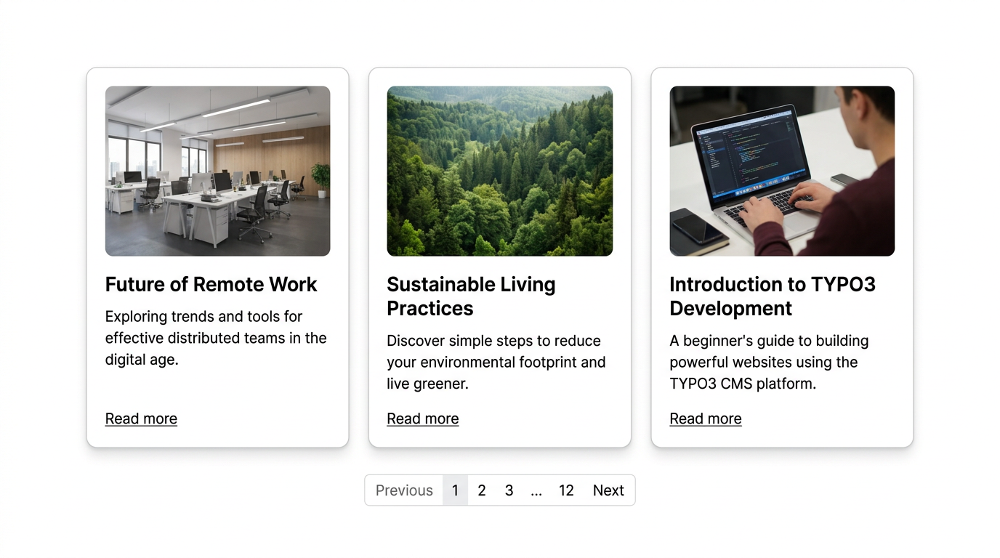

# pw_teaser – Page Teaser for TYPO3

[](https://github.com/dirnbauer/pw_teaser/actions/workflows/tests.yml)

Create dynamic page teasers from page properties and their content elements:
child pages, recursive trees or hand-picked pages, filtered by categories,
sorted, paginated and rendered with Fluid. Built on Extbase.

Maintained fork of [a-r-m-i-n/pw_teaser](https://github.com/a-r-m-i-n/pw_teaser)
(upstream unmaintained since 2023).



## Requirements

| pw_teaser | TYPO3              | PHP       |
|-----------|--------------------|-----------|
| 7.1       | 13.4 LTS, 14.3 LTS | 8.3 – 8.5 |
| 7.0       | 13.4, 14.0         | 8.2 – 8.4 |
| 6.x       | 11 – 13            | 8.1 – 8.3 |

## Install

Packagist still points `t3/pw_teaser` at the unmaintained upstream (6.0.3),
so register this repository first:

```bash
composer config repositories.pw-teaser vcs https://github.com/dirnbauer/pw_teaser
composer require t3/pw_teaser
```

Classic installs: [EXT:pw_teaser in TER](https://extensions.typo3.org/extension/pw_teaser).

## Configure

- **TypoScript** – add the site set `t3/pw-teaser` to `dependencies` in
  `config/sites/<site>/config.yaml`. Without site sets use
  `@import 'EXT:pw_teaser/Configuration/TypoScript/setup.typoscript'`
  (the static template include was removed in 7.1).
- **Template modes** (plugin tab *Template*) – `preset`: editors pick a
  TypoScript-defined preset (`default`, `headlineAndImage`, `headlineOnly` or
  your own under `plugin.tx_pwteaser.view.presets`); `file`: one Fluid template
  via `templateRootFile`; `directory`: Extbase convention (`Teaser/Index.html`
  plus partials/layouts) via `templateRootPath`.
- **Pagination** – on by default (`SimplePagination`, 10 items per page). For
  numbered pagination `composer require georgringer/numbered-pagination` and set
  `plugin.tx_pwteaser.settings.paginationClass = GeorgRinger\NumberedPagination\NumberedPagination`.
- **PSR-14** – `PwTeaserTeam\PwTeaser\Event\ModifyPagesEvent` exposes
  `getPages()` / `setPages()` to filter, sort or enrich the result before
  rendering; register a listener with `#[AsEventListener]`.

Full reference (settings, route enhancer, Page model, ViewHelpers):
[Documentation/](Documentation/) or
[docs.typo3.org](https://docs.typo3.org/p/t3/pw_teaser/main/en-us/).

## Use

1. Add the content element **Page Teaser** to a page.
2. Choose the source (children of this page, recursive, selected pages, …),
   optionally category filters, ordering and limit.
3. Pick a template preset on the *Template* tab.

Custom Fluid templates receive `{pages}` (Page models; `{page.get.<column>}`
reads any `pages` column) and `{pagination}`.

## Develop

```bash
composer install
composer ci:lint                 # php -l
composer ci:cgl                  # php-cs-fixer dry-run (TYPO3 coding standards)
composer ci:phpstan              # PHPStan level 8
composer ci:test:unit            # PHPUnit unit tests
typo3DatabaseDriver=pdo_sqlite composer ci:test:functional   # functional tests
composer update --with typo3/cms-core:^13.4                  # switch TYPO3 major
```

A DDEV setup is included (`ddev start && ddev install-v13`). Pull requests
against `master` are welcome.

## Docs

- [Documentation/](Documentation/) – installation, configuration reference,
  templates, events, testing
- [Upgrade notes 6.x → 7.x](Documentation/Upgrading/Index.rst)
- [CHANGELOG.md](CHANGELOG.md)

## License

GPL-2.0-or-later. Original author Armin Vieweg; fork maintained by
Kurt Dirnbauer ([webconsulting.at](https://webconsulting.at)).
